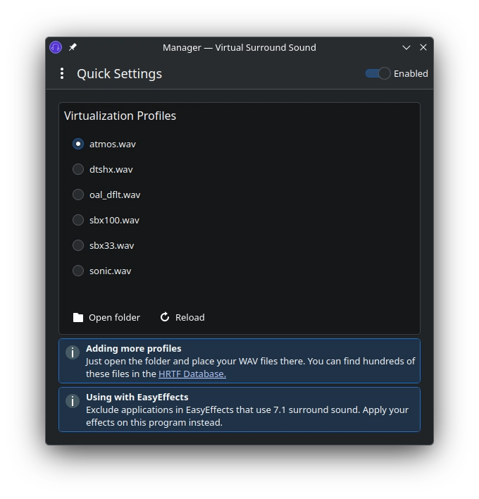

<h2 align="center">
  
   
  Virtual Surround Manager
</h2>

  <strong>Virtual 3D sound for headphones on Linux</strong>

## Features

- Enable or disable seemlessly, without changing your default device
- Drop in your own **HRIR WAV files** as virtualization presets, same as **HeSuVi** on Windows
- Can be run in the background with a **system tray icon** (check the app's settings)
- Compatible with **EasyEffects** (and most similar apps)
- Written entirely using the **PipeWire C API**, so no config files or annoying service restarts are required
- Modern user interface, built with **KDE's Kirigami 6 framework**
- Available languages are English, German, Russian and Italian
- This project is **not using** vibe coding, AI agents or similar tools for generating unmaintainable slop

## Screenshot

## Installation

### AppImage

Compatible with any distribution.
Just [Download](https://github.com/Berny23/virtual-surround-manager/releases/latest) and run. Use the "x86_64" file if you're unsure.

### AUR

For Arch Linux and derivatives. Install with your AUR manager, like: `yay -S virtual-surround-manager`

### Flatpak

FlatHub is planned.

### Third-party packages

These packages are maintained and provided by community members.

- [Fedora](https://software.opensuse.org/download/package?package=virtual-surround-manager&project=home%3AAndnoVember%3AFedora) (by AndnoVember)
- [Ubuntu/Debian](https://software.opensuse.org/download.html?package=virtual-surround-manager&project=home%3AAndnoVember%3ADebian) (by AndnoVember)
- [OpenSUSE](https://software.opensuse.org/download/package?package=virtual-surround-manager&project=home%3AAndnoVember%3ALXQt%3AQt6) (by AndnoVember)
- [Arch Linux](https://software.opensuse.org/download/package?package=virtual-surround-manager&project=home%3AAndnoVember%3AArch) (by AndnoVember)

## Usage

Enjoy your favorite games and movies in very realistic simulated surround sound!

Please don’t forget to open the settings of your game or media player and select real 7.1 or 5.1 audio output. Do not use any additional in-game virtualization setting (like a “headphone” or "3D audio" profile).

Please note: This app requires the PipeWire audio system. Recent Linux distributions use this by default, so don't worry about it.

To check if everything is working correctly, this is how audio routing should look like in [coppwr](https://flathub.org/de/apps/io.github.dimtpap.coppwr):
 

## Building

### Native

#### Dependencies for building the native package or AppImage

Arch Linux: `sudo pacman -S git ninja libpipewire base-devel extra-cmake-modules cmake kirigami ki18n kcoreaddons breeze kiconthemes qt6-base qt6-declarative qqc2-desktop-style`

For other distributions, just look up how the packages are called in your distro: https://pkgs.org

#### Native (for users)

1. Clone repository: `git clone https://github.com/Berny23/virtual-surround-manager.git`
2. Change directory: `cd virtual-surround-manager`
3. Prepare Build directory: `cmake -B build -G Ninja`
4. Build the project: `cmake --build build --config Release`
5. Install the project: `sudo cmake --install build --config Release`

#### Native (for developers)

1. Clone repository: `git clone https://github.com/Berny23/virtual-surround-manager.git`
2. Change directory: `cd virtual-surround-manager`
3. Prepare Build directory and set local install path: `cmake -B build -G Ninja --install-prefix ~/.local`
4. Build the project: `cmake --build build --config Debug`
5. Install the project: `cmake --install build --config Debug`

### Flatpak

1. Clone repository: `git clone https://github.com/Berny23/virtual-surround-manager.git`
2. Change directory: `cd virtual-surround-manager`
3. Build the flatpak: `flatpak-builder --force-clean --user --install-deps-from=flathub --repo=repo --install flatpak_build ./dist/flatpak/de.berny23.virtual_surround_manager.Devel.json`
4. Run the program: `flatpak run de.berny23.virtual_surround_manager`

### AppImage

1. Clone repository: `git clone https://github.com/Berny23/virtual-surround-manager.git`
2. Change directory: `cd virtual-surround-manager`
3. Build the AppImage: `./dist/appimage/build_virtual_surround_manager.sh`
4. Make executable: `chmod +x ./build_appimage/virtual-surround-manager-unknown-x86_64.AppImage`
5. Run the program: `./build_appimage/virtual-surround-manager-unknown-x86_64.AppImage`

## Acknowledgements

- The [EasyEffects](https://github.com/wwmm/easyeffects) project for research on the API, because the PipeWire docs are quite lacking for beginners
- The [HeSuVi](https://hesuvi.net) project for their awesome collection of HRIR WAV files
